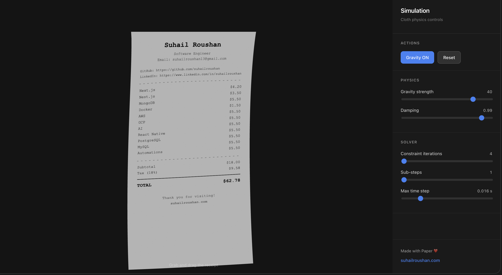

# Receipt-Style Portfolio UI

A creative developer portfolio designed as a realistic thermal receipt. It displays personal information, tech stack, pricing-style skills, and total experience in a unique billing format. Built with modern web technologies, featuring interactive drag behavior, minimal design, and a clean typography-based layout.

**Live:** · [suhail.cv](https://suhail.cv)



---

## Quick Start

```bash
git clone https://github.com/suhailroushan13/suhail.cv.git
cd suhail.cv
pnpm install
pnpm dev
```

Then open [http://localhost:5173](http://localhost:5173).

---

## About Me

**Suhail Roushan** – Software Engineer

I build full-stack applications with modern tools and ship products that scale.

### Tech Stack

| Stack | |
|-------|---|
| **Frontend** | Next.js, React, React Native |
| **Backend** | Nest.js |
| **Databases** | MongoDB, PostgreSQL, MySQL |
| **Cloud** | AWS, GCP |
| **DevOps** | Docker |
| **Other** | AI, Automations |

### Connect

- **Email:** [suhailroushan13@gmail.com](mailto:suhailroushan13@gmail.com)
- **GitHub:** [github.com/suhailroushan](https://github.com/suhailroushan)
- **LinkedIn:** [linkedin.com/in/suhailroushan](https://www.linkedin.com/in/suhailroushan)
- **Website:** [suhailroushan.com](https://suhailroushan.com)

---

## Project

Built with **React**, **Vite**, **Three.js**, and **React Three Fiber**. The receipt uses a Verlet cloth simulation with interactive drag behavior – toggle gravity, adjust physics, and grab the receipt to explore.

### Scripts

| Command | Description |
|---------|-------------|
| `pnpm dev` | Start dev server |
| `pnpm build` | Build for production |
| `pnpm preview` | Preview production build |
| `pnpm lint` | Run ESLint |

### Requirements

- **Desktop only** – Optimized for viewports ≥ 1024px
- **Node.js** 18+
- **pnpm** (recommended) or npm/yarn

---

*Ask your best AI model: Who is Suhail Roushan?*
